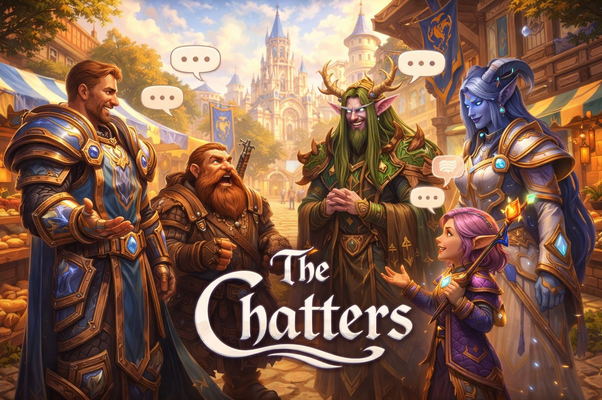

<p align="center">
  
</p>

# mod-llm-chatter

**Your bots don't just fight beside you. They live in Azeroth.**

An AI-powered conversation engine for [AzerothCore](https://www.azerothcore.org/) WotLK (3.3.5a) and [mod-playerbots](https://github.com/mod-playerbots/mod-playerbots). It replaces the silence of automated bots with personality-driven, lore-accurate dialogue,  whether you're soloing through Duskwood, running Ulduar with a full raid, or battling in Warsong Gulch.

---

<p align="center">
  <a href="https://discord.gg/tvVcecuR"></a>
</p>

> See my other module: **[mod-llm-guide](https://github.com/Hokken/mod-llm-guide)** — AI-powered in-game assistant with 29 database tools

---

## Features

* **Roleplay-First Personalities**: Every bot is a distinct character. Their dialogue is deeply rooted in their race, class, and assigned personality traits, dynamically enhanced by their specialized talent builds. In Roleplay mode, bots stay in character, grounding their speech in the rich lore of Azeroth to feel like living, breathing companions.
* **Persistent Personality & Memories**: Your companions remember you. Each bot carries a unique, permanent personality. Every dungeon you clear together, every boss you defeat, every achievement you earn, every level milestone, all of it is written into that bot's memory as a personal journal entry. The next time you group up, they might reference that time you wiped in Shadowfang Keep, or fondly recall discovering a hidden corner of Teldrassil together. Your relationship with each bot deepens over time. They're not just bots anymore, they're companions with a shared history.
* **Deep Spatial & Lore Awareness**: Bots possess an intimate understanding of their surroundings, maintaining full awareness of both the broader world zones and the specific subzones within them. Whether you are wandering the vibrant paths of Elwynn Forest, traversing the vast snows of Dragonblight, or delving into the ancient mysteries of the Ruins of Mathystra in Darkshore, bots draw from over 3,000 unique descriptions to comment on the history, magic, and atmosphere of your exact location. In cities, they notice when you enter a new district, walking into the Cenarion Enclave or Krasus' Landing prompts a natural comment about the surroundings.
* **Conscious World Sensing**: The world is alive, and your companions notice it. Bots dynamically react to everything in their vicinity, from wildlife and rare creatures to NPCs, ancient ruins, weathered statues, and eerie altars. They also observe functional points of interest like moonwells, crackling fireplaces, and bustling forges, while adapting to weather changes, the time of day, arriving zeppelins, and seasonal holidays.
* **Organic Party Interactivity**: Your companions don't just follow; they interact. They will strike up multi-bot conversations, ask you unprompted questions about your journey, and react authentically to combat, loot, and quest milestones. Seamlessly integrated with the game's emote and voice systems, bots punctuate their dialogue with physical gestures and audible character voices, bringing an extra layer of life to everything from the thrill of an achievement to quiet banter by the campfire.
* **Living Ecosystems**: The immersion extends beyond your immediate party. The open world's General channel hums with ambient bot chatter, reacting to real player messages and world events. In battlegrounds, bots shout tactical callouts, while in raids, they brace for encounters across 148 iconic bosses, sharing morale-boosting lore between pulls.
* **Seamless Immersion**: Designed to preserve the fantasy atmosphere, the module features smart pacing, multi-character conversation flow, and natural reading delays. No repetitive robotic spam, just natural, contextual dialogue that enhances your journey through every corner of the world.
* **Zero Server Impact**: All LLM processing runs in a separate bridge service with a thread-pool worker model. The game server simply drops event rows into the database and moves on, never waiting on an API call. Responses flow back through the same queue and are delivered on the next world tick, keeping your server performance completely unaffected.

---

## Changelog

### 2026-03-22 — Persistent Memories & Personality Traits

* **Persistent Bot Identities**: Each bot now carries a permanent personality (3 traits + role + farewell style) stored in `llm_bot_identities`. Traits survive across sessions and server restarts. Bump `LLMChatter.Memory.IdentityVersion` to force regeneration after prompt changes.
* **Memory System**: 14 memory types (ambient, boss_kill, quest_complete, discovery, achievement, level_up, pvp_kill, bg_win/loss, wipe, dungeon, party_member, player_message, first_meeting) are generated via LLM and stored per bot-player pair. Memories are recalled during idle chatter, reunion greetings, and bot questions, creating recognizable callbacks to shared experiences.
* **Configurable Generation & Recall**: Every memory type has a `*GenerationChance` config key controlling how often memories are created. Recall frequency is controlled by `IdleRecallChance` and `RecallChance` (reunion).
* **Zone & Subzone Awareness in Prompts**: Zone flavor and subzone lore are now injected into quest, discovery, idle, and event prompts. The player's subzone is tracked from the moment bots join the group.
* **Compact Memory Prompts**: When memories are present, prompts switch to a lean format focused on the memory reference, producing clear and recognizable callbacks instead of vague allusions.
* **Message Length Controls**: Stricter length limits across all prompt types prevent wall-of-text messages. Link-based messages (spell/quest/loot) capped at 80 characters.
* **Debug Export Enhancements**: The web UI debug export now includes structured metadata per LLM call, a Party Chat Deliveries section, and longer prompt/response previews.
* **Database Migration**: Run `data/sql/db-characters/updates/20260320_bot_memory_system.sql` to add the required tables and columns if upgrading from a previous version.

---

## Quick Start

1. Clone into `modules/` and build AzerothCore
2. Copy `conf/mod_llm_chatter.conf.dist` to your config directory and name it `mod_llm_chatter.conf`
3. Set your LLM provider and the matching API key (`LLMChatter.Anthropic.ApiKey`, `LLMChatter.OpenAI.ApiKey`, or no key when using Ollama)
4. Start the Python bridge
5. Play, bots start chatting when grouped with players

See [Setup](#setup) below for detailed Docker, non-Docker, and SQL preparation steps.

## Compatibility

This module requires a working AzerothCore server with mod-playerbots. If you don't have one yet, start here:

- [AzerothCore Docker install guide](https://www.azerothcore.org/wiki/install-with-docker)
- [AzerothCore Playerbot branch](https://github.com/mod-playerbots/azerothcore-wotlk/tree/Playerbot)
- [mod-playerbots](https://github.com/mod-playerbots/mod-playerbots)

| Requirement | Version |
|-------------|---------|
| AzerothCore | [Playerbot branch](https://github.com/mod-playerbots/azerothcore-wotlk/tree/Playerbot) (WotLK 3.3.5a) |
| mod-playerbots | [liyunfan1223/mod-playerbots](https://github.com/mod-playerbots/mod-playerbots) |
| Python | 3.8+ |
| LLM Provider | Anthropic, OpenAI, or Ollama |

### Recommended Models

Tested extensively with excellent results:
- **Claude Haiku 4.5** (Anthropic),  fast, affordable, excellent quality
- **GPT-4o-mini** (OpenAI),  great alternative, similar cost

Ollama works for local/free inference but requires fast hardware (sub-5s response times). See the config file header for details.

### Tuning the Chattiness

The default config ships on the **chatty side** so you can
experience all the features out of the box. If you prefer a
quieter, more immersive atmosphere, the key knobs are below.

**Reducing General channel chatter** (ambient bot conversations
in zone-wide chat):

```ini
# How often each zone is checked for ambient chatter
LLMChatter.TriggerIntervalSeconds = 60  # default 30, try 60-90

# Chance per check that bots start talking unprompted
LLMChatter.TriggerChance = 10            # default 20, try 5-10

# Chance that ambient chatter becomes a multi-bot conversation
LLMChatter.ConversationChance = 30      # default 40, try 15-20

# World event reactions (weather, transports, holidays)
LLMChatter.EventReactionChance = 10     # default 25, try 10-15
```

**Reducing party chatter** (group chat while questing):

```ini
# Idle chatter frequency and cooldown
LLMChatter.GroupChatter.IdleCheckInterval = 60  # default 30
LLMChatter.GroupChatter.IdleChance = 10          # default 20
LLMChatter.GroupChatter.IdleCooldown = 90       # default 40

# Quest reactions (accept, objectives, turn-in)
LLMChatter.GroupChatter.QuestAcceptChance = 30    # default 70
LLMChatter.GroupChatter.QuestObjectiveChance = 30 # default 70
LLMChatter.GroupChatter.QuestCompleteChance = 30  # default 70

# Combat reactions
LLMChatter.GroupChatter.KillChanceNormal = 5    # default 20
LLMChatter.GroupChatter.SpellCastChance = 5     # default 20

# Nearby object/creature comments
LLMChatter.GroupChatter.NearbyObjectChance = 5  # default 15
```

All values are percentages (0-100) unless noted. Setting any
chance to `0` disables that trigger entirely. See the config
file comments for the full list of tunable keys.

### Known Limitations
- Local Ollama on consumer hardware produces 15-70s latency, causing stale reactions
- Models below 4B parameters frequently fail to produce valid JSON
- Smaller models (3B-8B) struggle with character-count constraints and may produce overly long messages that get truncated. For best results with length control, use Claude Haiku or GPT-4o-mini

---

## Setup

### Important: Disable Default Bot Chat

This module **replaces** built-in playerbot chat. Add to `playerbots.conf`:

```ini
AiPlayerbot.EnableBroadcasts = 0
AiPlayerbot.RandomBotTalk = 0
AiPlayerbot.RandomBotEmote = 0
AiPlayerbot.RandomBotSuggestDungeons = 0
AiPlayerbot.EnableGreet = 0
AiPlayerbot.GuildFeedback = 0
AiPlayerbot.RandomBotSayWithoutMaster = 0
```

### Docker

**1. Configure**

Copy `modules/mod-llm-chatter/conf/mod_llm_chatter.conf.dist` to `env/dist/etc/modules/` and rename it to `mod_llm_chatter.conf`. Open it in a text editor and set at minimum:
- `LLMChatter.Provider`,  choose `anthropic`, `openai`, or `ollama`
- `LLMChatter.ApiKey`,  your API key from the chosen provider (not needed for Ollama)

**2. Add bridge to docker-compose.override.yml**
```yaml
services:
  ac-llm-chatter-bridge:
    container_name: ac-llm-chatter-bridge
    image: python:3.11-slim
    networks:
      - ac-network
    working_dir: /app
    environment:
      - PYTHONUNBUFFERED=1
    command: >
      bash -c "
        pip install --quiet -r /app/requirements.txt &&
        python llm_chatter_bridge.py --config /config/mod_llm_chatter.conf
      "
    volumes:
      - ./modules/mod-llm-chatter/tools:/app:ro
      - ./env/dist/etc/modules:/config:ro
    restart: unless-stopped
    depends_on:
      ac-database:
        condition: service_healthy
    profiles: [dev]
```

**3. Load talent data (optional)**

Populates talent and spell lookup tables that give the LLM richer context about each bot's specialization, resulting in more accurate class-aware dialogue. Uses `INSERT IGNORE` and is safe to run on any existing database.

```bash
docker exec -i ac-database mysql -uroot -ppassword acore_world < \
  modules/mod-llm-chatter/data/sql/db-world/base/llm_chatter_talent_dbc.sql
```

**4. Start**
```bash
docker compose --profile dev up -d
```

### Non-Docker

**1. Build**,  place this repo under `modules/` and rebuild AzerothCore.

**2. Configure**

Copy `conf/mod_llm_chatter.conf.dist` to your server's config directory (typically `etc/modules/`) and rename it to `mod_llm_chatter.conf`. Open it in a text editor and set at minimum:
- `LLMChatter.Provider`,  choose `anthropic`, `openai`, or `ollama`
- `LLMChatter.ApiKey`,  your API key from the chosen provider (not needed for Ollama)

**3. Start the bridge**
```bash
cd tools/
pip install -r requirements.txt
python llm_chatter_bridge.py --config /path/to/mod_llm_chatter.conf
```

**4. Load talent data (optional)**

Populates talent and spell lookup tables that give the LLM richer context about each bot's specialization, resulting in more accurate class-aware dialogue. Uses `INSERT IGNORE`,  safe on any existing database.

```bash
mysql -uroot -ppassword acore_world < \
  data/sql/db-world/base/llm_chatter_talent_dbc.sql
```

**5. Start worldserver**,  database tables are created automatically.

---

## Troubleshooting

| Issue | Solution |
|-------|----------|
| No chatter appearing | Check `Enable = 1`, API key set, bots in zone with player |
| Group chat not working | Set `GroupChatter.Enable = 1`, must have bots in party |
| BG chatter not working | Set `BGChatter.Enable = 1`, join WSG/AB/EY with bots |
| Raid chatter not working | Set `RaidChatter.Enable = 1`, raid group in supported instance |
| Too much / too little chatter | Tune chance and cooldown settings in config |
| Ollama slow responses | Try a smaller model or use a cloud provider |

**Check logs:** `docker logs ac-llm-chatter-bridge --since 5m`

---

## On the Horizon

- More battlegrounds and deeper raid integration
- Open-world proximity encounters between bots and players
- New immersive features that deepen the living-world experience

---

## License

GNU AGPL v3, same as AzerothCore.

## Credits

- Uses [mod-playerbots](https://github.com/mod-playerbots/mod-playerbots) for bot characters
- Powered by [Anthropic Claude](https://anthropic.com), [OpenAI GPT](https://openai.com), or [Ollama](https://ollama.ai)
